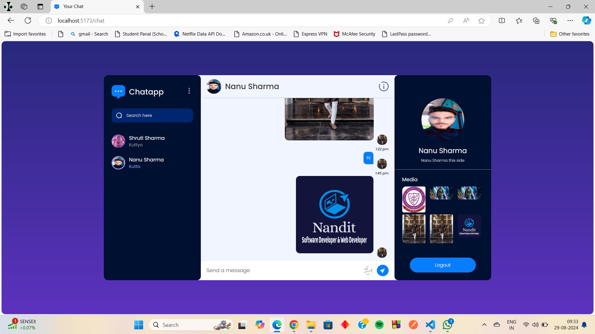

# MERN Stack Chat Application Overview
  This project is a fully functional chat application developed using the MERN stack (MongoDB, Express.js, React.js, and Node.js). It incorporates a user-friendly interface and essential features such as user authentication, password recovery, and real-time chat functionality. Below is a detailed overview of the application's features and the technologies used.
  
**Visit**: https://chat-app-front-end-667v.onrender.com/

## Key Features 
### **User Authentication**
- **Sign Up**: Users can create a new account by providing necessary details such as username, email, and password.
- **Log In**: Registered users can log in with their credentials. JSON Web Tokens (jsonwebtoken) are used for secure authentication and session management.
- **Forgot Password**: Users can reset their password through an forgot password page, ensuring that their accounts remain secure and accessible.

### **Real-Time Chat**
- **Home Chat Page**: Users can see a list of their chats and start a new conversation with friends. The chat page is designed to be intuitive and easy to navigate.
- **Chatting Page**: The chatting interface allows users to exchange messages in real time. Messages are stored in a MongoDB database, ensuring persistence.

### **Responsive Design**
- **All Devices**:The application is fully responsive, ensuring a smooth experience on both desktop and mobile devices. Screenshots demonstrate how the application adapts to different screen sizes, maintaining usability and accessibility.

## Technologies Used
### Frontend
  - **React**: The frontend is built using React, allowing for a dynamic and interactive user interface. Components such as Sign Up, Log In, and Chat Pages are designed with a focus on user experience.
  - **CSS**: Custom styling is applied to ensure that the application is visually appealing and consistent across different devices.

### Middleware
  - **Cors**: CORS (Cross-Origin Resource Sharing) is enabled to allow communication between the frontend and backend.
  - **Cookie-Parser**: This middleware is used to parse cookies, enabling the application to handle sessions and user authentication.

### Backend
  - **Node.js & Express.js**: The backend is built using Express.js, a minimal and flexible Node.js web application framework. It handles routing, authentication, and API endpoints.
  - **MongoDB & Mongoose**: MongoDB, a NoSQL database, is used for storing user data, chat messages, and other relevant information. Mongoose provides a schema-based solution to model the application data.
  - **Authentication & Security**
     - **bcrypt**: Passwords are securely hashed using bcrypt, ensuring that user credentials are stored safely.
     - **jsonwebtoken**: JWTs are used for secure authentication and session management.
  - **File Uploads**
    - **Multer & Cloudinary**: Multer is used for handling file uploads (e.g., user avatars), and Cloudinary is integrated to store and manage these files in the cloud.

 ### Development Tools
  - **Nodemon**: Nodemon is used in development for automatically restarting the server whenever changes are made to the backend code.
  - **Prettier**: Prettier is used to format the codebase, ensuring consistency and readability.

## Conclusion
This chat application showcases a comprehensive use of the MERN stack to create a modern, responsive, and secure real-time messaging platform. The integration of essential tools and libraries ensures that the application is both robust and maintainable. Whether you're using it on a desktop or mobile device, the application provides a seamless user experience.
## Sign Up

## Log In

## Forgot Password

## Home Chat Page

## Chatting Page

## Log in responsive 

## Chat responsive 

## Chatting responsive

